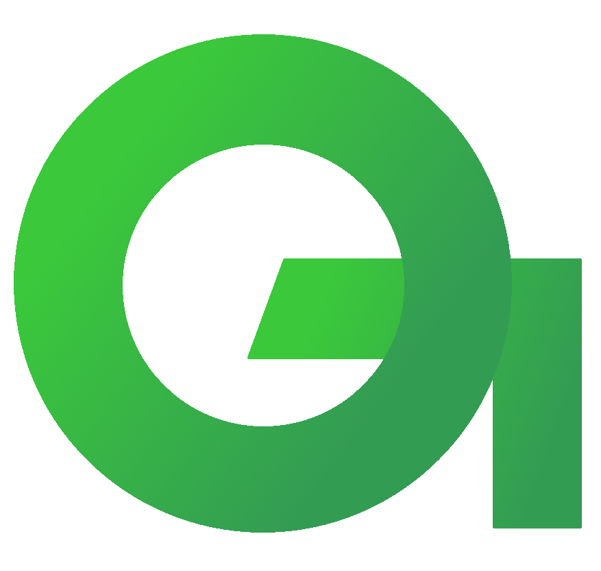

    

<h1 align="center">Gigwerk Freelancer App (Cookie)</h1>

In this guide we will set you up and teach you how to contribute.

## Requirements
- We recommend using WebStorm which you can find <a href="https://www.jetbrains.com/webstorm/download">here</a>. Otherwise <a href="https://code.visualstudio.com/download">Visual Studio Code</a> works fine. You'll need something that you can write TypeScript code comfortably in. 
- You should have the API set up before you set up the frontend. Find that <a href="https://github.com/gigwerk-io/api">here</a>.
## Installation
- Clone the dev branch by running, `git clone https://github.com/gigwerk-io/cookie-pwa.git`
- Create a new branch for your ticket from develop with the ticket's name, `git branch GIGWERK-{your ticket number}`
- Install ionic globally `npm install -g @ionic/cli`
- Install tailwindcss angular cli `npm i ng-tailwindcss -g`
- Run `npm install`
## Resources
- For UI Components we use <a href="https://tailwindui.com/">Tailwind UI</a>. Virtually all of our css needs are handled by this utility. You will likely never write css code on this project if you learn how to use it. Learn more <a href="https://tailwindcss.com/course">here</a>
- For UI icons used in buttons and elsewhere this project uses a Flaticons UI interface pack. Most of them are already downloaded but if you find that one you need isn't in `.src/assets/icon/interface/*.svg` go <a href="https://www.flaticon.com/packs/ui-interface-25">here</a> to find them. **Make sure to download svg only**
- For 'artsy' iconography we use Undraw as our design solution. Find that <a href="https://undraw.co/search">here</a>. **Make sure to set the color of the Undraw images to #3AC23E** before downloading them into the project. These Undraw images are located in `./src/assets/undraw`.
- Never hurts to learn some <a href="https://angular.io/">Angular</a>, <a href="https://angular.io/">Capacitor</a> and <a href="https://rxjs-dev.firebaseapp.com/">RxJS</a> either as these are always going to be in use. On a lesser extent we are lightly using the <a href="https://ionicframework.com/">Ionic Framework</a>. **Lightly!** we don't want to use almost any of their components. However, if you're in a pinch you may be able to get away with using something lowkey like an Ion List or Ion Item. Beware we will most likely have custom built components already for almost all of our needs.
## Coding Pracices
## Useful Tidbits
